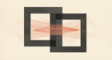
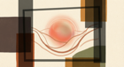
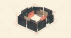
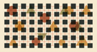

# How to Talk to Anyone: 27 Subtype Communication Guides

## You fixed how your AI writes. Now fix who it writes for.

Generic communication is a coin flip. You write something clear, concise, and well-structured, send it to ten people, and get ten different reactions. Three people love it. Two ignore it. One gets offended. Four skim it and forget it existed.

The problem is not your writing. The problem is that people do not process messages the same way. Personality science has mapped 27 distinct subtypes, each driven by a different instinctual filter that shapes how they receive, prioritize, and react to incoming information. These filters run automatically, beneath conscious awareness, and they cannot be overridden.

The 27 subtypes break down across three instinct families:

- **Farmer:** Filters for safety, resources, stability, and practical utility. Nine types, each with a different survival strategy.
- **Teamer:** Filters for belonging, status, group dynamics, and group positioning. Nine types, each with a different relationship to the group.
- **Hunter:** Filters for intensity, connection, power, and personal impact. Nine types, each with a different expression of drive.

Every guide below profiles one subtype: what triggers them, what shuts them down, before-and-after rewrites, and a **free prompt you can paste into any LLM** to optimize your message for that person.

---

## Farmer Subtypes

| | Subtype | Type | Core Filter | Key Risk |
|---|---|---|---|---|
|  | [Worry](./FARMER_ONE_WORRY.md) | One | Be good and correct through disciplined self-improvement | Vague expectations |
|  | [Privilege](./FARMER_TWO_PRIVILEGE.md) | Two | Be loved and prioritized for who they are | Cold transactional openings |
|  | [Security](./FARMER_THREE_SECURITY.md) | Three | Earn security through quality, integrity, and productivity | Hype without proof |
|  | [Tenacity](./FARMER_FOUR_TENACITY.md) | Four | Endure pain through stoic effort and disciplined work | Pity framing |
|  | [Castle](./FARMER_FIVE_CASTLE.md) | Five | Maintain safety through boundaries, privacy, and self-sufficiency | Repeated pings and intrusion |
|  | [Warmth](./FARMER_SIX_WARMTH.md) | Six | Create safety through trustworthy alliances and dependable connection | Surprise changes |
|  | [Keepers of the Castle](./FARMER_SEVEN_KEEPERS.md) | Seven | Secure advantage through pragmatic alliances and opportunities | Abstract philosophy without utility |
|  | [Satisfaction](./FARMER_EIGHT_SATISFACTION.md) | Eight | Timely satisfaction of material needs with zero frustration tolerance | Indirect openers |
|  | [Appetite](./FARMER_NINE_APPETITE.md) | Nine | Maintain comfort through routine, concrete activity, and low friction | Abstract strategy talk |

## Teamer Subtypes

| | Subtype | Type | Core Filter | Key Risk |
|---|---|---|---|---|
|  | [Non-Adaptability](./TEAMER_ONE_NON_ADAPTABILITY.md) | One | Model the right way through principled correctness and authority | "Just trust me" language |
|  | [Ambition](./TEAMER_TWO_AMBITION.md) | Two | Win influence and advantages through strategic generosity | Modesty-only framing |
|  | [Prestige](./TEAMER_THREE_PRESTIGE.md) | Three | Achieve visible success, status, and influence through competition | Vague excellence language |
|  | [Shame](./TEAMER_FOUR_SHAME.md) | Four | Seek belonging while managing shame and painful self-comparison | Tough love bluntness |
|  | [Totem](./TEAMER_FIVE_TOTEM.md) | Five | Find meaning through shared knowledge, ideals, and frameworks | Shallow slogans |
|  | [Duty](./TEAMER_SIX_DUTY.md) | Six | Reduce anxiety through rules, authority, and procedural certainty | Informal ambiguity |
|  | [Sacrifice](./TEAMER_SEVEN_SACRIFICE.md) | Seven | Be good and valuable through service, idealism, and self-restraint | Cynical tone |
|  | [Solidarity](./TEAMER_EIGHT_SOLIDARITY.md) | Eight | Use strength to protect others and lead with loyal action | Detached analysis without protective mission |
|  | [Participation](./TEAMER_NINE_PARTICIPATION.md) | Nine | Belong through group participation while losing personal priorities | Exclusion cues |

## Hunter Subtypes

| | Subtype | Type | Core Filter | Key Risk |
|---|---|---|---|---|
|  | [Zeal](./HUNTER_ONE_ZEAL.md) | One | Reform what is wrong with urgent moral intensity | Passive voice and hidden agency |
|  | [Seduction](./HUNTER_TWO_SEDUCTION.md) | Two | Secure needs through intense personal magnetism and power | Coy ambiguity |
|  | [Charisma](./HUNTER_THREE_CHARISMA.md) | Three | Achieve through attractiveness, advocacy, and promoting others | Self-only bragging |
|  | [Competition](./HUNTER_FOUR_COMPETITION.md) | Four | Transform deficiency into competitive intensity and recognition | Vague harmony talk |
|  | [Confidence](./HUNTER_FIVE_CONFIDENCE.md) | Five | Seek deep trust and ideal connection while protecting inner world | Superficial banter |
|  | [Strength](./HUNTER_SIX_STRENGTH.md) | Six | Master fear by projecting strength and defensive capability | Timid framing |
|  | [Suggestibility](./HUNTER_SEVEN_SUGGESTIBILITY.md) | Seven | Pursue exciting possibilities with enthusiastic imaginative focus | Dream stacking without execution |
|  | [Possession](./HUNTER_EIGHT_POSSESSION.md) | Eight | Secure influence and power through intensity and environmental control | Passive requesting |
|  | [Fusion](./HUNTER_NINE_FUSION.md) | Nine | Maintain connection by merging with significant others | Speaking for them |

---

## How to Use This Series

**Read the article.** Pick the subtype that matches your recipient. You'll get the filter they use, 5 mistakes that kill your message, and before-and-after rewrites.

**Use the free prompt.** Paste your draft into ChatGPT, Claude, or any LLM, then paste the prompt from the article. The model rewrites your message for that subtype.

**Pair with the AI Smells guide.** This series fixes *who* your message targets. The [AI Smells Remover](./you-smell-like-bad-ai-2026-02-14.md) fixes *how* your AI writes. Use both.

**Go deeper.** This is what [Rally](https://www.rally.ai/) does automatically: communications optimized for each person's instinctual profile, at scale, without the manual prompting.
